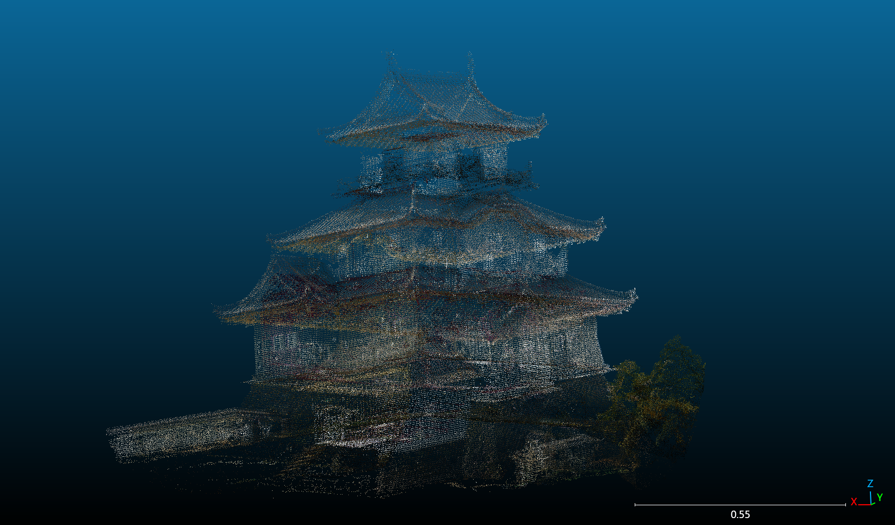
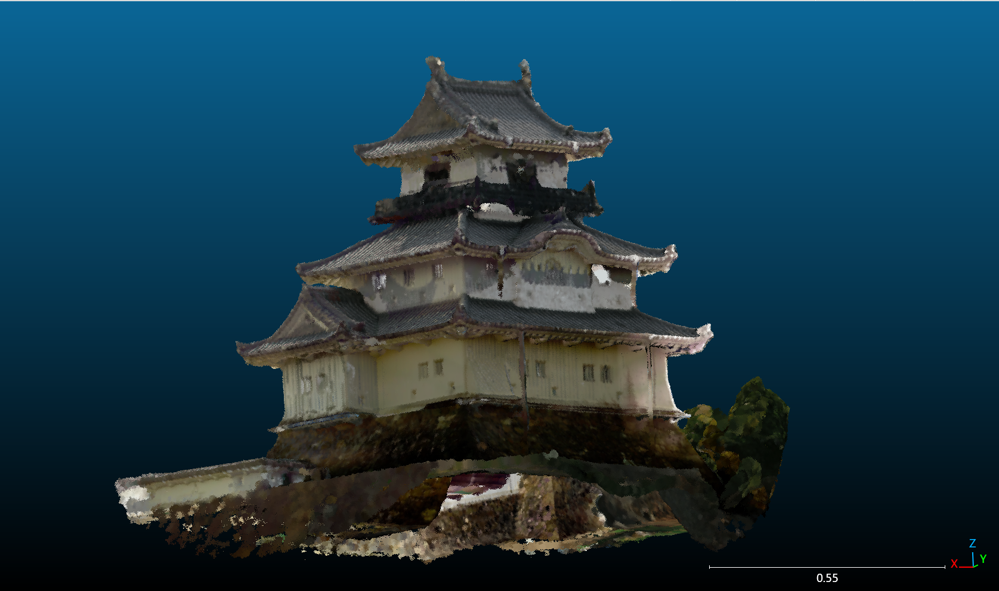

# osiro1
# Castle-SeedFormer

## 概要
本プロジェクトは、点群補完モデル **[SeedFormer](https://github.com/hrzhou2/seedformer.git)** をベースに、日本の城郭建築（お城や神社など）の大規模点群データ向けにファインチューニングを行ったカスタムモデルです。

従来の手法では困難だった、1億点規模の巨大な点群データの処理を可能にするため、データの分割処理や学習プロセスの最適化を行いました。我々は、お城のジオラマデータを学習に用い、スマートフォンで撮影した実在するお城の点群データを補完・修復することに成功しています。

## デモ / 実行結果
実際に欠損したお城の点群データを修復した結果です。

<p align="center">
  
  
</p>
<p align="center">
  <b>Left: Input (Defective) | Right: Output (Restored)</b>
</p>
## 主な機能と変更点
オリジナルのSeedFormerに対し、以下の改良を加えています。

### 1. 大規模点群への対応
* **課題**: オリジナルモデルは `partial` 入力の上限が約2048点であり、1億点を超えるお城のデータをそのまま学習させることは不可能でした。
* **解決策**: 大規模点群を細かく分割（チャンク化）して学習するパイプラインを構築しました。

### 2. データクレンジングと学習の効率化
* 分割の際、点数が2048点に満たないチャンクはノイズと見なし、学習データから除外する処理を追加しました。
* 各 `partial` データにおいて、最も点群密度が高い（点数が多い）視点を優先的に採用するロジックを実装し、学習効率を向上させました。

### 3. 主要な変更ファイル
* `train_pcn.py`: 学習プロセスの最適化
* `data_loader.py`: 大規模データの分割読み込み対応
* `manager.py`: 学習管理ロジックの変更
* `run_castle_inference.py`: 推論実行用スクリプトの調整

## 環境構築
* Python 3.x
* PyTorch
* Open3D
* **GCC/G++ 9** (Required for compiling custom CUDA ops)

## 使用方法 (Workflow)

### 1. データセットの作成 (Training)
自分のデータ（お城や神社など）で学習を行う場合の手順です。

1.  学習させたい大規模点群データ（PLY形式など）を用意します。
2.  **`学習データ整形用.ipynb`** を実行します。
    * このノートブックは、入力データを `complete`（教師データ）と `partial`（5視点からの欠損データ）に整形し、`train_pcn.py` で扱えるデータセット形式に変換します。
3.  学習を実行します。
    * **注意**: カスタムオペレーションのコンパイルには `gcc-9` / `g++-9` が必要です。
    ```bash
    CC=gcc-9 CXX=g++-9 python3 train_pcn.py
    ```

### 2. 推論の実行 (Inference)
学習済みモデルを使って、欠損のあるデータを修復する手順です。

1.  補完したい点群ファイルを **`推論データ整形用.ipynb`** に入力し、前処理を行います。
2.  `run_castle_inference.py` 内の `path` 変数を、整形したデータのパスに変更します。
3.  スクリプトを実行します。
    ```bash
    CC=gcc-9 CXX=g++-9 python3 run_castle_inference.py
    ```

## 議論・今後の展望
* **補完力と精度のトレードオフ**:
    推論時に欠損が著しい場合、`train_pcn.py` のパラメータを調整することで「補完力」を高めることは可能です。しかし、補完力を強めすぎると全体がぼやけた（平滑化された）出力になる傾向があり、ディテールとのトレードオフが発生しています。
* **ビジュアルの改善**:
    推論結果の見た目（テクスチャや密度など）を追求する場合は、`run_castle_inference.py` の後処理アルゴリズムをさらに改良する必要があります。

## 参考文献・クレジット
* Original Model: [SeedFormer](https://github.com/hrzhou2/seedformer.git)

## 著者
* **鴻上 峻太朗 (Shuntaro Kogami)**
* 九州大学 工学部 電気情報工学科 (Kyushu University, Department of Electrical and Information Engineering)
# Castle-SeedFormer

## Overview
This project is a custom point cloud completion model fine-tuned for large-scale Japanese castle architecture (such as castles and shrines), based on **[SeedFormer](https://github.com/hrzhou2/seedformer.git)**.

Processing massive point cloud data (approx. 100 million points) is difficult for conventional methods. To address this, we optimized the data splitting process and the training pipeline. We successfully trained the model using castle diorama data and performed inference/restoration on real-world castle point clouds scanned with smartphones.

## Demo / Results


## Key Features & Modifications
We have made the following improvements to the original SeedFormer:

### 1. Support for Large-Scale Point Clouds
* **Challenge**: The original model had an input limit of approximately 2048 points per `partial` input, making it impossible to directly train on castle data with over 100 million points.
* **Solution**: We implemented a pipeline to split (chunk) large-scale point clouds into smaller segments for training.

### 2. Data Cleansing & Training Efficiency
* **Noise Filtering**: Added a process to exclude chunks with fewer than 2048 points during splitting to eliminate noise.
* **Viewpoint Optimization**: Implemented logic to prioritize and select the viewpoint with the highest point density for each `partial` dataset, improving training efficiency.

### 3. Key Modified Files
* `train_pcn.py`: Optimized the training process.
* `data_loader.py`: Adapted for loading split large-scale data.
* `manager.py`: Modified training management logic.
* `run_castle_inference.py`: Adjusted for inference execution.

## Requirements
* Python 3.x
* PyTorch
* Open3D
* **GCC/G++ 9** (Required for compiling custom CUDA operations)

## Usage Workflow

### 1. Dataset Creation (Training)
Follow these steps to train the model with your own data (castles, shrines, etc.):

1.  Prepare the large-scale point cloud data (e.g., PLY format).
2.  Run the notebook **`学習データ整形用.ipynb` (Training_Data_Preprocessing.ipynb)**.
    * This notebook formats the input data into `complete` (ground truth) and `partial` (defective data from 5 viewpoints) sets suitable for `train_pcn.py`.
3.  Run the training script.
    * **Note**: `gcc-9` and `g++-9` are required to compile the custom operations.
    ```bash
    CC=gcc-9 CXX=g++-9 python3 train_pcn.py
    ```

### 2. Inference
Follow these steps to restore defective point clouds using the trained model:

1.  Input the target point cloud file into **`推論データ整形用.ipynb` (Inference_Data_Preprocessing.ipynb)** for preprocessing.
2.  Update the `path` variable in `run_castle_inference.py` to point to the formatted data.
3.  Run the inference script:
    ```bash
    python3 run_castle_inference.py
    ```

## Issues & Future Outlook
* **Trade-off between Completion Strength and Precision**:
    When significant parts are missing during inference, modifying parameters in `train_pcn.py` can improve the model's completion capability. However, stronger completion often results in blurrier (over-smoothed) outputs, creating a trade-off with detail retention.
* **Visual Improvements**:
    To achieve better visual quality in the inference results (textures, density), further modifications to the post-processing algorithms in `run_castle_inference.py` are required.

## References & Credits
* Original Model: [SeedFormer](https://github.com/hrzhou2/seedformer.git)

## Author
* **Shuntaro Kogami**
* Department of Electrical and Information Engineering, Kyushu University